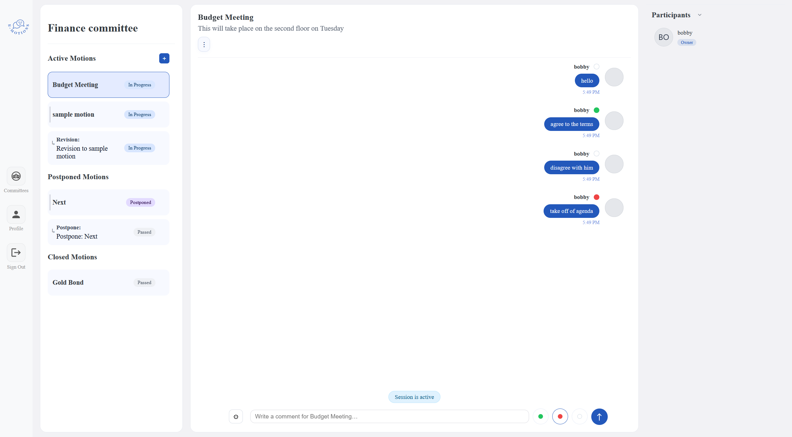
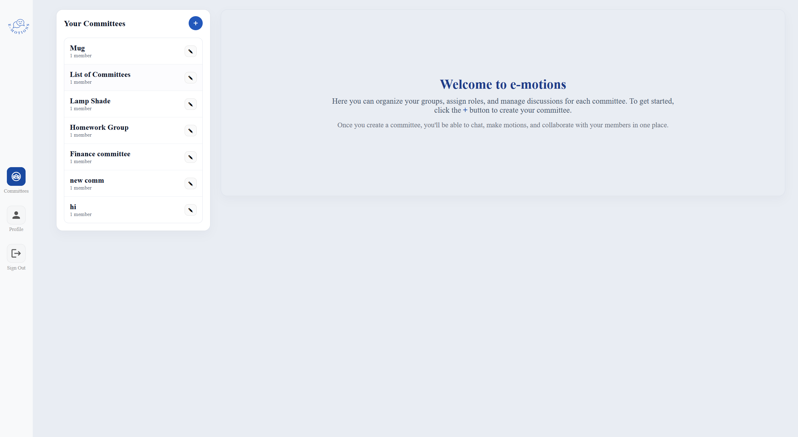
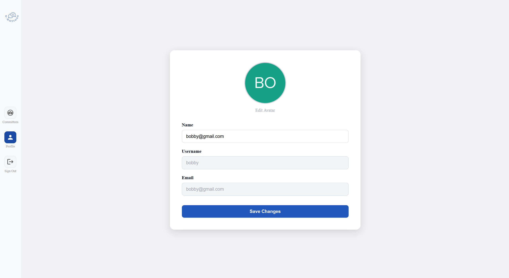
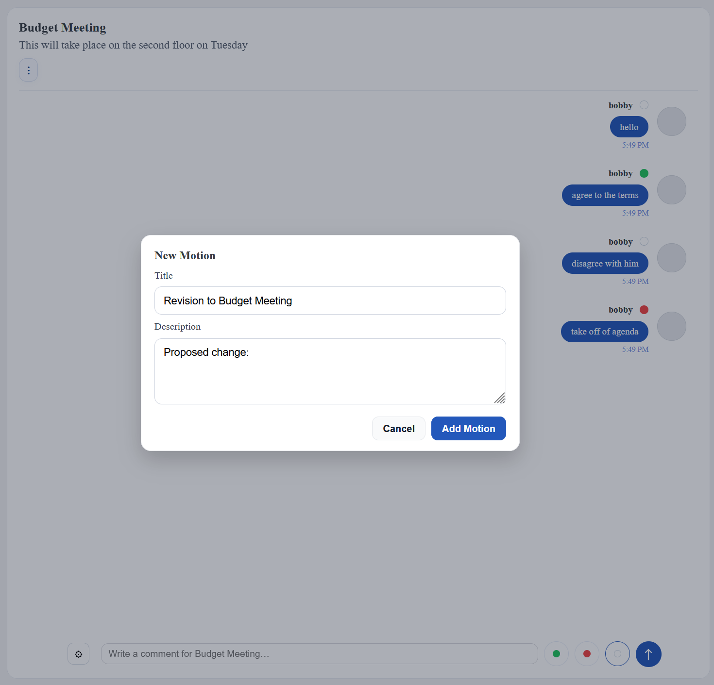
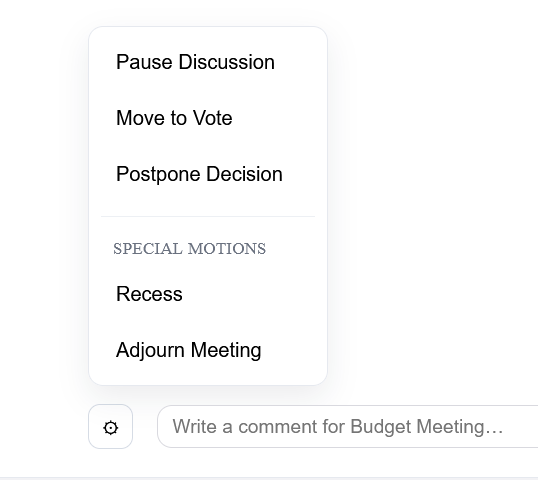
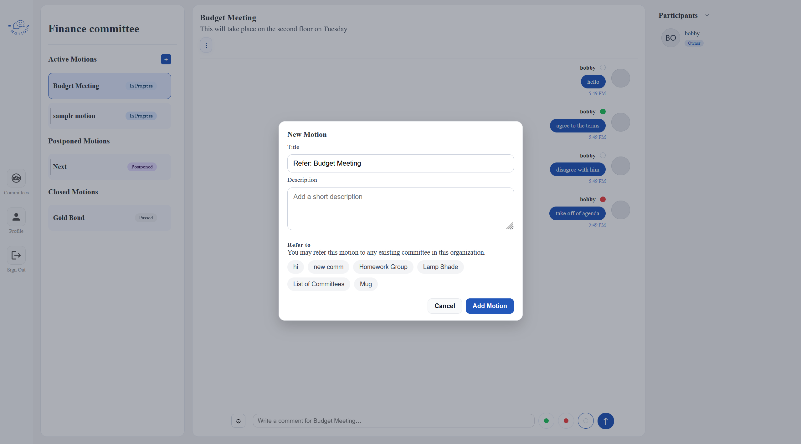
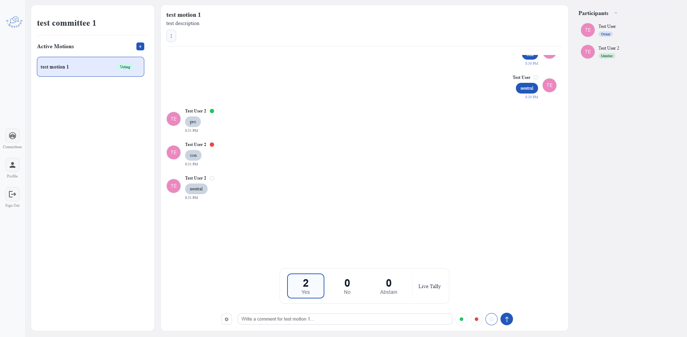
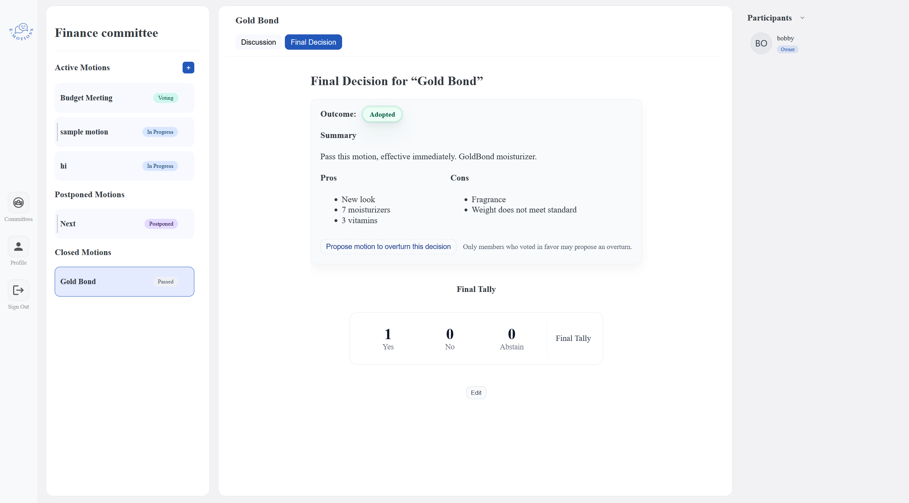

## e-motions (Robert’s Rules of Order Web Platform)

e-motions is a web-based platform that enables committees and organizations to conduct meetings in accordance with **Robert’s Rules of Order (RONR)**. The system supports structured discussions, formal motions, debate, and voting with built-in rule enforcement.

The platform provides user authentication, committee and meeting management, role-based participation, and a chat-style interface designed to mirror real parliamentary procedure in a digital environment.

---

🔗 https://e-motnz.netlify.app

## Video Demo

🔗

## API Documentation

Detailed API references for committees, meetings, motions, discussions, profiles, and authentication are available here:
🔗 https://www.notion.so/e-motions-API-Documentation-2cb11a2300f4803586c7ed51e60f9a90

---

## Database Schema

An overview of the database structure, collections, and relationships between entities (committees, members, motions, discussions, and votes) can be found here:  
🔗 https://www.notion.so/Database-Schema-2cb11a2300f48028af23d1e3f78777bb

---

## Features

Discussion / Chat

Create Committee

User Profile

Amend Motion

Chair Controls

Refer Motion

Voting

Final Decision Summary

