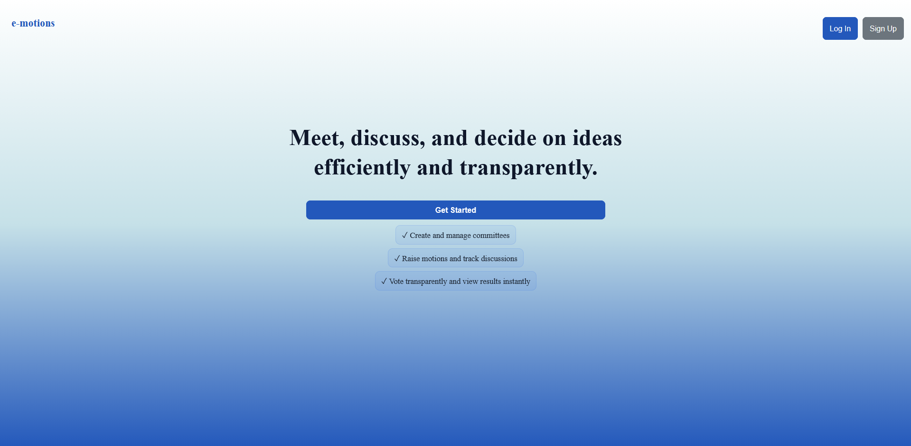
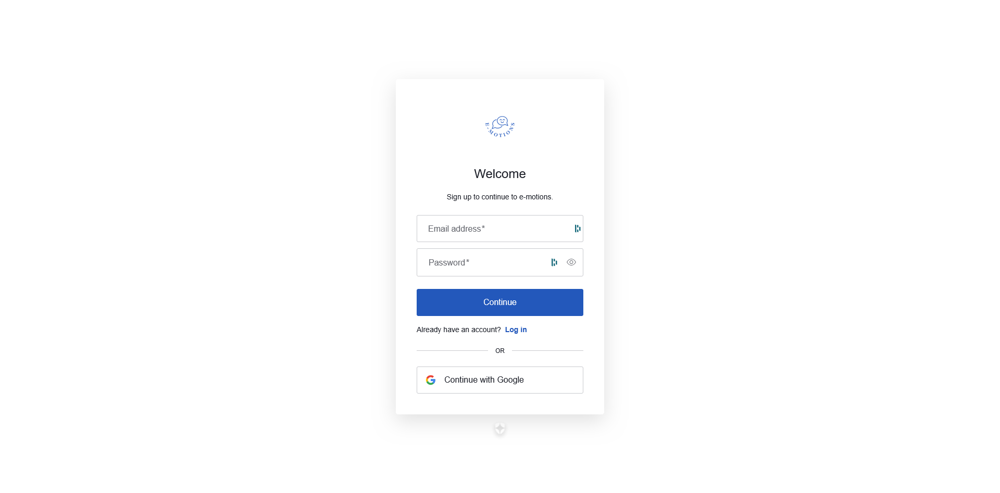
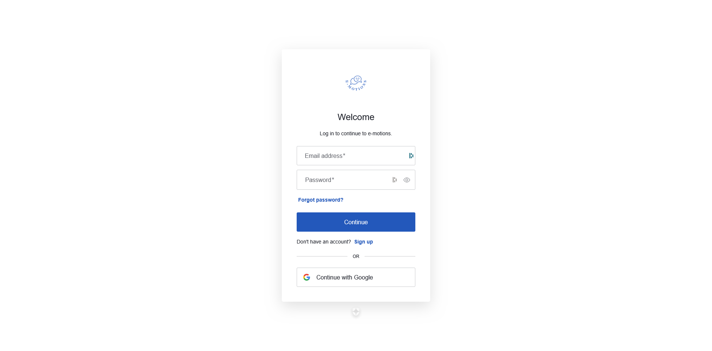
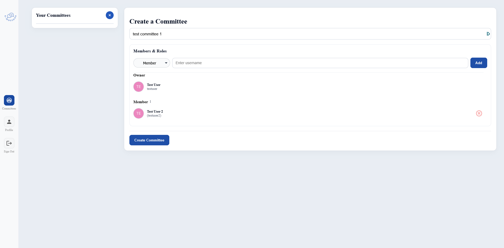
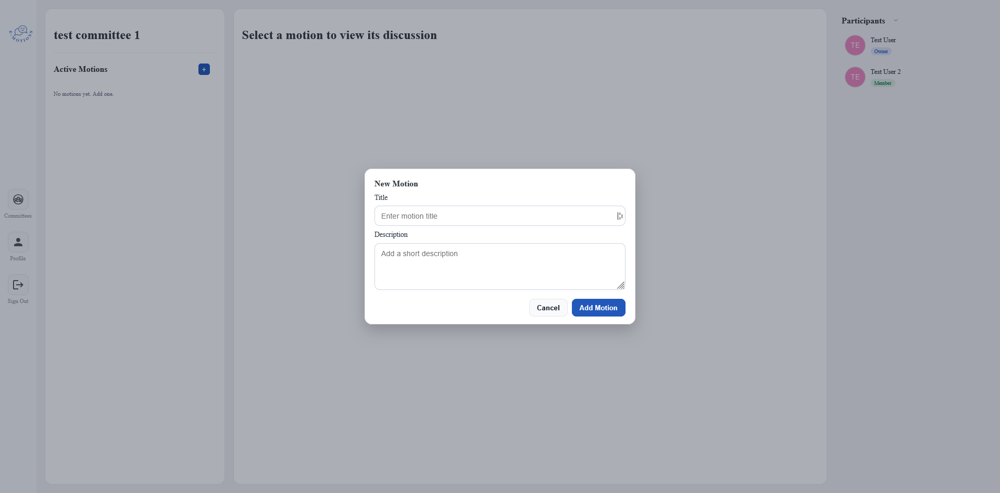
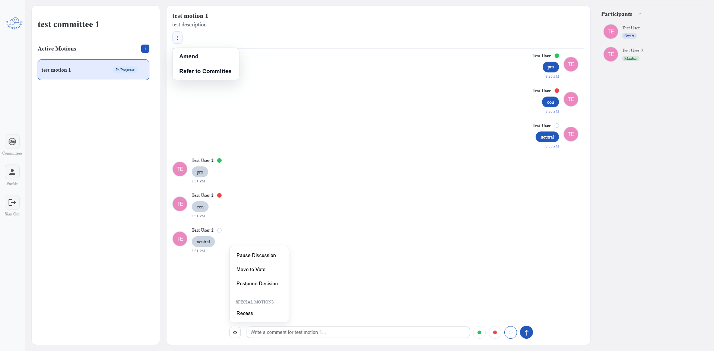
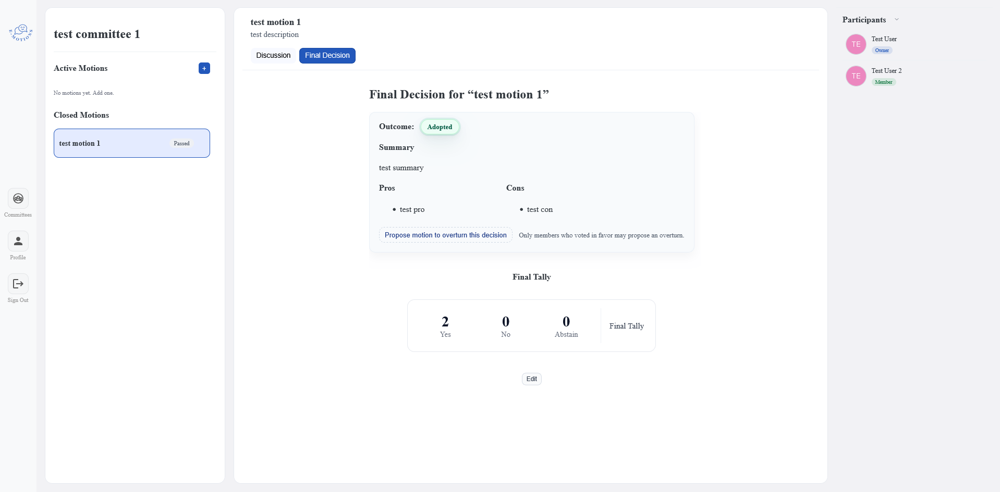

## e-motions (Robert’s Rules of Order Web Platform)

e-motions is a web-based platform that enables committees and organizations to conduct meetings in accordance with **Robert’s Rules of Order (RONR)**. The system supports structured discussions, formal motions, debate, and voting with built-in rule enforcement.

The platform provides user authentication, committee and meeting management, role-based participation, and a chat-style interface designed to mirror real parliamentary procedure in a digital environment.

## Video Demo

🔗 https://youtu.be/8cWiRhhPAUc

## API Documentation

Detailed API references for committees, meetings, motions, discussions, profiles, and authentication are available here:

🔗 https://www.notion.so/e-motions-API-Documentation-2cb11a2300f4803586c7ed51e60f9a90

## Database Schema

An overview of the database structure, collections, and relationships between entities (committees, members, motions, discussions, and votes) can be found here:  

🔗 https://www.notion.so/Database-Schema-2cb11a2300f48028af23d1e3f78777bb

## Features

### Landing Page
The landing page presents **e-motions** with a clear mission statement and a prominent **Get Started** button, alongside **Log In** and **Sign Up** options. It briefly highlights core features such as committee management, motion discussion, and transparent voting.

### Authentication (Sign Up)
New users can create an account by providing an email and password or signing up with Google. A link is provided to switch back to the log-in flow for existing users.

### Authentication (Log In)
Returning users can sign in using their email and password or continue with Google. Account recovery and a link to the sign-up page are available before entering the application.

### Profile Management
Users can view and edit their profile information, including their display name and avatar. The profile page also shows the user’s username and email, with changes saved directly to their account.

### Committees Dashboard
After signing in, users arrive at the Committees dashboard, where they can view all committees they belong to. A prominent **+** button allows users to create a new committee, while the main panel provides guidance on organizing groups, assigning roles, and managing discussions within each committee.

### Create a Committee
Users can create a new committee by providing a committee name and adding members by username. Roles can be assigned during creation, with the creator automatically set as the owner. Once configured, the committee is created and added to the user’s dashboard.

### Creating a Motion
Within a committee, users can propose a new motion by providing a title and brief description. Once submitted, the motion becomes active and available for discussion and voting by committee members.

### Motion Discussion & Parliamentary Actions
Once a motion is selected, committee members participate in a structured discussion by posting comments tagged with a stance (**pro**, **con**, or **neutral**). Authorized users can also initiate parliamentary actions such as amending the motion, referring it to committee, pausing discussion, moving to a vote, postponing the decision, or calling a recess, enforcing formal procedure based on Robert’s Rules of Order.

### Voting & Live Results
When a motion is moved to a vote, committee members can cast **Yes**, **No**, or **Abstain** votes directly within the interface. A live tally updates in real time, providing transparent visibility into the current voting outcome while preserving structured procedure.

### Final Decision & Outcome Summary
After voting concludes, the motion moves to a final decision view that summarizes the outcome (e.g., adopted or rejected), presents a concise summary, and lists key pros and cons raised during discussion. The final vote tally is displayed for transparency, and eligible members may propose a motion to overturn the decision if permitted.

